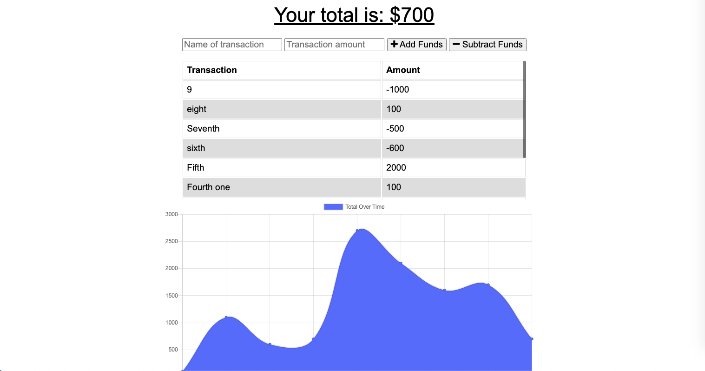

# budget tracker
  
  
  

  ## Description 

  _Track your income and spending and graph it out visually all in this easy to use web app. Add income values coming in, and subtract money coming out._
 
  ## Table of Contents

  * [Usage](#usage)
  * [Screenshot](#screenshot)
  * [Created With](#created-with)
  * [Contributing](#contributing)
  * [Questions](#questions)
  

  ## Usage 

  * _Visit the web app link @ protected-basin-21646.herokuapp.com._
    * _Once you're on the website you can choose to install the app into your device for offline usage._
  * _Type in the name of your transaction._
  * _Type in the value of said trasaction._
  * _Choose whether the transaction will add or subtract funds unto your budget._
  * _Watch your graph update._ 

  ## Screenshot
  
  

  ## Created With

  * _Javascript_
  * _CSS_
  * _HTML_
  * _Node_
  * _Express_
  * _Mongoose_
  * _Heroku_
  * _IndexedDB_
  * _MondoDB Atlas_

  ## Contributing

  _Free to use and edit. Just clone the repository for improvements._

  ---
  ## Questions?
  _Contact me:_
  _[@daejo](github.com/daejo)_  
  _[https://github.com/daejo/budget-tracker](https://github.com/daejo/budget-tracker)_  
  
